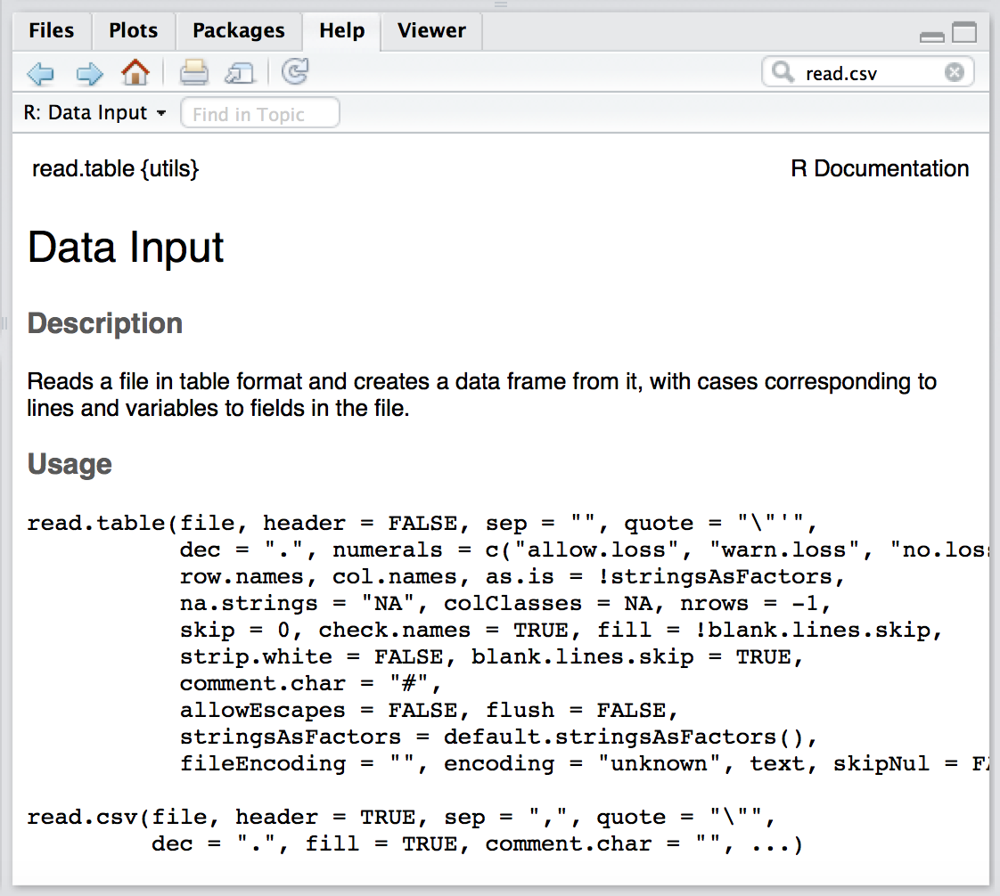
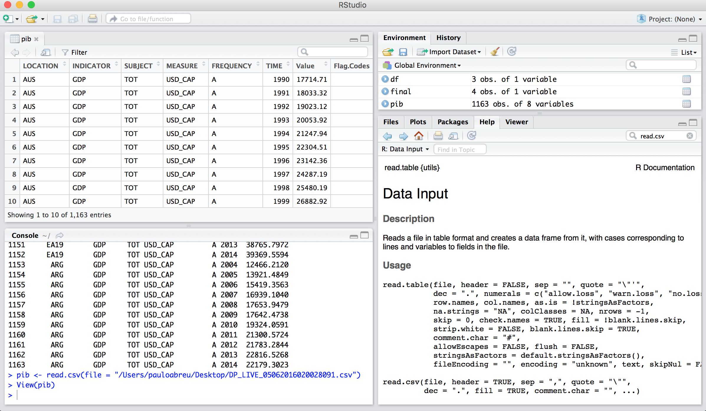

No capítulo "Operações Básicas" vimos como criar um data frame
na linha de comando, digitando todos os valores para cada
coluna do data frame. Isso é útil quando temos uma quantidade 
relativamente pequena de dados, mas na maioria dos 
casos vamos trabalhar com "tabelas" que têm dezenas
de colunas e possivelmente milhares de linhas. Ninguém
espera ter que digitar isso tudo, ao contrário, você vai
receber esses dados em um arquivo.

O R pode ler qualquer tipo de arquivo texto e, com a ajuda
de "pacotes" externos (vamos ver isso mais para frente)
o R pode ler diretamente planilhas Excel.

Vamos começar com um tipo de arquivo muito comum e popular
para se compartilhas dados: arquivos "csv" (comma separated
values). Se você é um usuário de planilhas provavelmente
já se deparou com arquivos csv. Esse tipo de arquivo
é muito popular para se compartilhar dados entre diferentes
sistemas operacionais (Unix, Linux, Mac, Windows)
pois, por conter apenas texto,
pode ser entendido praticamente por qualquer máquina.

Se você procurar por dados abertos na Internet vai encontrar
muita coisa que pode ser baixada em formato csv.
Por exemplo, no site da OECD
(https://data.oecd.org/gdp/gross-domestic-product-gdp.htm)
você encontra dados do PIB de vários países ao longo 
de muitos anos.

Vamos usar os dados de *PIB per capta* de 1990 a 2015 de todos os
países disponíveis. Por via das dúvidas, baixei esse arquivo
no dia 4 de junho de 2016 e ele está disponível aqui:

https://raw.githubusercontent.com/abreups/doexcelaor/master/dados/DP_LIVE_05062016020028091.csv

Baixe esse arquivo e salve em um diretório conhecido do seu
computador. No meu caso ele está salvo no meu Desktop.
O "diretório" (ou pasta) no meu computador é (estou usando
um Mac):
````r
/Users/pauloabreu/Desktop
````

Muito bem. Para lermos este arquivo para dentro do R usamos 
a função `read.csv()`.

Se você der uma olhadinha no help dessa função você verá que
ela aceita alguns parâmetros:




Peraí! Mas por que no help da função `read.csv()` tem essa função
`read.table()`?

Bem, porque a função `read.csv()` é "a mesma coisa" que a função 
`read.table()` só que alguns parâmetros passados para a 
função já estão pré-definidos. Por exemplo, como o próprio
nome diz, um arquivo csv tem os dados separados por vírgula,
certo? Então, o parâmetro `sep` na função `read.table()`
está definido como "vazio" (`sep = ""`); já na função 
`read.csv()` ele está definido como `sep = ","`, isto
é, o caracter que separa os dados é uma vírgula.

Outra coisa: num arquivo csv "bem comportado" a primeira
linha do arquivo costuma ser o cabeçalho, certo? É
a linha que tem os "nomes das colunas". Essa primeira
linha é o "header". Veja que na função `read.table()`
o header está definido como `FALSE`, ou seja, o *default*
é que não tem header. Já na função `read.csv()` ele está
definido como `header = TRUE`: sim, há um cabeçalho.

OK, passado o susto, veja que o primeiro parâmetro
a ser passado para a função é `file`, ou seja,
o nome do arquivo (com o caminho para encontrá-lo).

Quando você passa parâmetros para uma função do R
você pode colocar o parâmetro na mesma sequencia
que o help indica ou dizer explicitamente qual
parâmetro você está passando.

Por exemplo, podemos usar a função `read.csv()` assim:

````r
read.csv("nome_do_arquivo.csv")
````

ou assim:

````r
read.csv(file = "nome_do_arquivo.csv")
````

Pode parecer meio besta usar a segunda forma já
que a primeira funciona, mas se você quiser
especificar que o separador de dados não é uma
vírgula mas, por exemplo, uma barra vertical `|`,
é mais fácil (e seguro) usar o nome do parâmetro
do que ficar contando qual a posição dele na
lista de parâmetros (eu particularmente nunca fiz isso).
Na prática você vai fazer assim:

````r
read.csv(file = "nome_do_arquivo.csv", sep="|")
````

e veja que assim també é válido:

````r
read.csv(sep="|", file = "nome_do_arquivo.csv")
````

pois a função `read.csv()` vai saber exatamente o que
é cada coisa que você está passando para ela.

Chega de conversa e vamos carregar o arquivo.
Digite o comando comando

````r
read.csv(file = "/Users/pauloabreu/Desktop/DP_LIVE_05062016020028091.csv")
````

e veja o que acontece.

Provavelmente você viu um monte de letras e números
passando pela tela da console até parar com o 
prompt `> `. Que foi isso?

O comando `read.csv()` foi lá onde você indicou, leu
o arquivo e listou na tela da console o arquivo
inteiro.

Ah, mas peraí. Queremos guardar os dados do arquivo
para usar depois! Vamos então guardar os resultado
do comando numa variável! Quer tal, `pib`:

````r
pib <- read.csv(file = "/Users/pauloabreu/Desktop/DP_LIVE_05062016020028091.csv")
````

Execute o comando e repare que a variável `pib` tem 
1163 observações (linhas) e 8 variáveis (colunas).

Clique no nome da variável `pib` lá na área
de "Environment" no canto superior direito e você
verá uma prévia dessa variável no canto superior
esquerdo da janela do R Studio. Seu ambiente deve
se parecer com isso:



A coluna LOCATION possui o nome do país representado
pelo código ISO de 3 letras (veja essa referência, por
exemplo: https://pt.wikipedia.org/wiki/ISO_3166-1), a coluna
TIME possui o ano e a coluna Value possui o valor
do PIB per capta.

As colunas INDICATOR, SUBJECT, MEASURE e FREQUENCY
informam que o indicador é GDP (isto é, PIB), 
o valor total do PIB (TOT), a medida do PIB (que
é PIB per capta) e a frequencia da medida (que é
anual). A coluna Flag.Codes indica, por exemplo,
se o valor do PIB é estimado.
Veja, nada disso tem a ver com o R. Esta é a descrição
dos dados que obtivemos do site da OEDC.

Com a função `class(pib)` você vai ver que nossa variável `pib`
é do tipo `data.frame` e com o comando `str(pib)` você
consegue ver a "estrutura" da variável.


````r
> class(pib)
[1] "data.frame"
> str(pib)
'data.frame':	1163 obs. of  8 variables:
 $ LOCATION  : Factor w/ 50 levels "ARG","AUS","AUT",..: 2 2 2 2 2 2 2 2 2 2 ...
 $ INDICATOR : Factor w/ 1 level "GDP": 1 1 1 1 1 1 1 1 1 1 ...
 $ SUBJECT   : Factor w/ 1 level "TOT": 1 1 1 1 1 1 1 1 1 1 ...
 $ MEASURE   : Factor w/ 1 level "USD_CAP": 1 1 1 1 1 1 1 1 1 1 ...
 $ FREQUENCY : Factor w/ 1 level "A": 1 1 1 1 1 1 1 1 1 1 ...
 $ TIME      : int  1990 1991 1992 1993 1994 1995 1996 1997 1998 1999 ...
 $ Value     : num  17715 18033 19023 20054 21248 ...
 $ Flag.Codes: Factor w/ 3 levels "","B","E": 1 1 1 1 1 1 1 1 1 1 ...
> 
````

O tipo `factor` já vimos: é a "mesma coisa" que o tipo texto,
mas representa categorias. Veja que, apesar de termos 1163
linhas, há apenas 50 tipos Factor. Como a coluna LOCATION
contém o nome do país, significa que temos 50 países
representados (quer dizer que temos várias linhas por país;
é meio óbvio, pois cada linha contém o PIB de um determinado
ano...).

TIME e Value são variáveis numéricas. A diferença entre o tipo
`int` e o tipo `num` é basicamente o "tamanho do número"
que cada uma consegue representar (mas isso não é importante
agora).

Relembrando algumas funções básicas, se quisermos saber
o maior PIB per capta e o menor PIB per capta, podemos 
usar as funções `max()` e `min()`, respectivamente (o
valor do PIB está na coluna `Value`).

````r
> max(pib$Value)
[1] 100309.5
> min(pib$Value)
[1] 972.9963
> 
````

E para recuperar a linha inteira de cada um daqueles
valores:

```r
> pib[pib$Value == max(pib$Value),]
    LOCATION INDICATOR SUBJECT MEASURE FREQUENCY TIME    Value Flag.Codes
441      LUX       GDP     TOT USD_CAP         A 2015 100309.5           
> pib[pib$Value == min(pib$Value),]
    LOCATION INDICATOR SUBJECT MEASURE FREQUENCY TIME    Value Flag.Codes
804      CHN       GDP     TOT USD_CAP         A 1990 972.9963           
> 
````

LUX é o país Luxemburgo e CHN é China.

Deixe-me ler seus pensamentos... Você agora entrou em
pânico porque você não lembra como se chega nesses
comandos acima. Acertei?

Se eu acertei, então vamos devagar porque a ideia aqui
é você introjetar esse negócio até ficar tão craque
que você não vai nem se lembrar mais do que era planilha
Excel. :-)

1. Achar o PIB máximo você sabe, certo? É só usar a função
`max()` e passar a coluna onde estão os PIBs, que é
a coluna `Value` da nossa variável `pib`. Portanto:
`max(pib$Value)`. Se você fizer só isso você vai 
obter um número (que é o valor máximo de PIB encontrado
na coluna. No caso, `100309.5`). Digite o comando
pra ver o resultado.

2. Agora você quer saber em qual linha está esse valor.
Então pense assim: "o valor não é `100309.5`. O valor
é `max(pib$Value)`".

3. Onde é que `pib$Value` (que é a coluna inteira
dos valores de PIBs) é **igual** a esse valor
aí que você quer? Sacou? **Igual**! Ou seja, `==`.
Então: `pib$Value == max(pib$Value)`.

4. O resultado de `pib$Value == max(pib$Value)` é
um monte de `FALSE` e um único `TRUE` (a menos
que tenhamos exatamente o mesmo valor numérico
em mais de uma linha. Haja coincidência, não?).
Digite esse comando para ver o resultado (na dúvida
faça sempre isso. Vá digitando os comandos pra ver
o que acontece. Use a seta para cima do teclado
 para economizar digitação!).

5. Se o comando anterior é um monte de `FALSE` e
`TRUE`, então basta colocá-lo como parâmetro de 
linha no par `[ linhas , colunas ]` do data frame `pib`.
Ou seja, recheamos `pib[ linhas , colunas ]` trocando
"linhas" por aquele treco que me dá um monte de `FALSE`
e `TRUE`. E deixamos "colunas" vazio para indicar
que queremos todas as colunas: 
`pib[  pib$Value == max(pib$Value)  ,  ]`.

Espero que você tenha acompanhado o raciocínio passo-a-passo.
É assim que eu me habituei a fazer mentalmente quando
tenho que escrever esses comandos que geram um subconjunto
de dados. E eu literalmente vou fazendo desse jeito: começo
com o comando mais de dentro e vou colocando o sinal
de `==`, depois os colchetes, até chegar no comando final.
Fica a dica!

Passado o ataque de pânico, voltemos à análise dos dados.

Como os dados de PIB vão de 1990 até 2015, vemos que em 2015
Luxemburgo estava "no topo da lista" e em 1990 a China estava
"no fundo do poço".

> Uma paradinha rápida para umas continhas. Estamos
> lidando com "PIB per capta", ou seja, por habitante.
> A China tinha aproximadamente 1 billhão de
> habitantes em 1990 e Luxemburgo uns 500 mil.
> Multiplicando o PIB per capta pela quantidade de
> habitantes vemos que o PIB da China em 1990 era
> de mais ou menos 972 bilhões de dólares enquanto
> o PIB de Luxemburgo em 2015 era de mais ou menos
> 50 bilhões de dólares.


Mas como será o histórico do PIB de Luxemburgo e da China?
Ano após ano?

Não existe uma única forma de se obter esses resultados, mas
várias. Cada um acaba criando sua forma preferida.
Eu gosto de fazer assim:

1. separo os dados do país em uma variável

2. faço as manipulações usando essa variável

Vamos separar os dados de Luxemburgo em uma
variável que vamos chamar de ... `lux`!
Vou usar o método de primeiro criar uma
variável só com as linhas e depois usar
essa variável para indicar quais a linhas
que queremos. 

````r
> linhas <- pib$LOCATION == "LUX"
> lux <- pib[linhas,]
> lux
    LOCATION INDICATOR SUBJECT MEASURE FREQUENCY TIME     Value Flag.Codes
416      LUX       GDP     TOT USD_CAP         A 1990  32078.98          E
417      LUX       GDP     TOT USD_CAP         A 1991  35528.24          E
418      LUX       GDP     TOT USD_CAP         A 1992  36499.62          E
419      LUX       GDP     TOT USD_CAP         A 1993  38389.87          E
420      LUX       GDP     TOT USD_CAP         A 1994  40120.25          E
421      LUX       GDP     TOT USD_CAP         A 1995  40965.36          E
422      LUX       GDP     TOT USD_CAP         A 1996  42373.76          E
423      LUX       GDP     TOT USD_CAP         A 1997  42993.49          E
424      LUX       GDP     TOT USD_CAP         A 1998  45513.66          E
425      LUX       GDP     TOT USD_CAP         A 1999  51652.81          E
426      LUX       GDP     TOT USD_CAP         A 2000  56502.68           
427      LUX       GDP     TOT USD_CAP         A 2001  56186.40           
428      LUX       GDP     TOT USD_CAP         A 2002  59352.93           
429      LUX       GDP     TOT USD_CAP         A 2003  60836.74           
430      LUX       GDP     TOT USD_CAP         A 2004  65389.76           
431      LUX       GDP     TOT USD_CAP         A 2005  67002.98           
432      LUX       GDP     TOT USD_CAP         A 2006  77257.99           
433      LUX       GDP     TOT USD_CAP         A 2007  82724.29           
434      LUX       GDP     TOT USD_CAP         A 2008  84920.06           
435      LUX       GDP     TOT USD_CAP         A 2009  80238.87           
436      LUX       GDP     TOT USD_CAP         A 2010  84498.64           
437      LUX       GDP     TOT USD_CAP         A 2011  90888.71           
438      LUX       GDP     TOT USD_CAP         A 2012  90693.65           
439      LUX       GDP     TOT USD_CAP         A 2013  95587.31           
440      LUX       GDP     TOT USD_CAP         A 2014  98110.11           
441      LUX       GDP     TOT USD_CAP         A 2015 100309.46           
> 
````

Vamos fazer o mesmo para a China, mas vou pular
a parte de criar a variável `linhas` e partir
direto pro resultado final. Vou guardar os dados
da China numa variável chamada `chn` (que falta de
criatividade, não?):

````r
> chn <- pib[pib$LOCATION == "CHN",]
> chn
    LOCATION INDICATOR SUBJECT MEASURE FREQUENCY TIME      Value Flag.Codes
804      CHN       GDP     TOT USD_CAP         A 1990   972.9963           
805      CHN       GDP     TOT USD_CAP         A 1991  1084.4292           
806      CHN       GDP     TOT USD_CAP         A 1992  1252.9136           
807      CHN       GDP     TOT USD_CAP         A 1993  1444.9063           
808      CHN       GDP     TOT USD_CAP         A 1994  1650.0839           
809      CHN       GDP     TOT USD_CAP         A 1995  1850.0712           
810      CHN       GDP     TOT USD_CAP         A 1996  2049.3573           
811      CHN       GDP     TOT USD_CAP         A 1997  2253.9802           
812      CHN       GDP     TOT USD_CAP         A 1998  2435.0231           
813      CHN       GDP     TOT USD_CAP         A 1999  2638.9491           
814      CHN       GDP     TOT USD_CAP         A 2000  2904.4079           
815      CHN       GDP     TOT USD_CAP         A 2001  3194.8246           
816      CHN       GDP     TOT USD_CAP         A 2002  3516.0108           
817      CHN       GDP     TOT USD_CAP         A 2003  3921.8194           
818      CHN       GDP     TOT USD_CAP         A 2004  4409.7043           
819      CHN       GDP     TOT USD_CAP         A 2005  5038.5384           
820      CHN       GDP     TOT USD_CAP         A 2006  5821.4689           
821      CHN       GDP     TOT USD_CAP         A 2007  6789.5701           
822      CHN       GDP     TOT USD_CAP         A 2008  7550.4994           
823      CHN       GDP     TOT USD_CAP         A 2009  8269.9616           
824      CHN       GDP     TOT USD_CAP         A 2010  9216.6720           
825      CHN       GDP     TOT USD_CAP         A 2011 10249.9396           
826      CHN       GDP     TOT USD_CAP         A 2012 11187.0640           
827      CHN       GDP     TOT USD_CAP         A 2013 12166.1382           
828      CHN       GDP     TOT USD_CAP         A 2014 13170.7968           
> 
````

Com os dados dos países separados assim, dá pra calcular
os valores máximos e mínimos para cada um deles facilmente.
Vamos então calcular o valor máximo do PIB da China
e o valor mínimo do PIB de Luxemburgo.

````r
> max(chn$Value)
[1] 13170.8
> min(lux$Value)
[1] 32078.98
> 
````

E a linha completa onde estão esses valores (agora não tem moleza;
faça o raciocínio aí):

````r
> chn[chn$Value == max(chn$Value),]
    LOCATION INDICATOR SUBJECT MEASURE FREQUENCY TIME   Value Flag.Codes
828      CHN       GDP     TOT USD_CAP         A 2014 13170.8           
> lux[lux$Value == min(lux$Value),]
    LOCATION INDICATOR SUBJECT MEASURE FREQUENCY TIME    Value Flag.Codes
416      LUX       GDP     TOT USD_CAP         A 1990 32078.98          E
> 
````

A SEGUIR:

O QUE PODE DAR ERRADO AO LER UM ARQUIVO CSV.

(LINHAS ANTES DO CABEÇALHO E SEP DIFERENTE DE VÍRGULA)


COMO SALVAR UM ARQUIVO CSV


CAPÍTULO DE SCRIPTS

CARREGANDO UM ARQUIVO DINAMICAMENTE DEFINIDO PELO USUARIO.


### Lendo arquivos csv


Executando passo a passo temos:

````r
> rm(list=ls())
> setwd("~/Documents/blog")
> getwd()
[1] "/Users/pauloabreu/Documents/blog"
> dados <- read.csv("pib2.csv")
Erro em read.table(file = file, header = header, sep = sep, quote = quote, :
more columns than column names
> dados
Erro: objeto 'dados' não encontrado
````

O que aconteceu foi o seguinte:

primeiro limpamos todas as variáveis da memória com o comando 'rm(list=ls())' para que resultados obtidos anteriormente não possam causar confusão.
ajustamos o working directory para o local onde você baixou o arquivo pib2.csv (e conferimos com getwd, que é um passo "desnecessário" mas está aqui só por questões "didáticas").
tentamos ler o arquivo mas aí temos um erro.
e a variável dados nem pode ser criada por conta do erro.
Vamos dar uma olhada no conteúdo do arquivo pib2.csv:

> # Valores de PIB em dólares americanos
> # posição corresponde ao ranking mundial do país
> # Fonte: http://pt.wikipedia.org/wiki/Lista_de_pa%C3%ADses_por_PIB_nominal
> Pais,PIB,posicao
> Estados Unidos,14586736,1
> China,5815501,2
> Japão,5458836,3
> Alemanha,3391641,4
> Franca,2671113,5
> Brasil,2350889,6

As 3 primeiras linhas não são dados propriamente ditos, mas explicações a respeito dos dados que virão mais adiante (taí um "mini codebook" pra você).

Apesar de útil para sabermos, por exemplo, que o valor do PIB está em dólares americanos, não precisamos disso para a captura dos dados. O que gostaríamos de fazer é pular essas três primeiras linhas!

Existe um parâmetro na função 'read.table' (que é aproveitado nas funções derivadas dela como a read.csv) chamado 'skip'.

Dê uma olhada na documentação de read.csv digitando '?read.csv' na linha de comando do R (ou R Studio).

O que skip faz é... pular uma certa quantidade de linhas no início do arquivo!

Ajustemos nosso código para:

````r
dados <- read.csv("pib2.csv", skip=3)
````

Executando de novo passo a passo desde o começo:

````r
> rm(list=ls())
> setwd("~/Documents/blog")
> getwd()
[1] "/Users/pauloabreu/Documents/blog"
> dados <- read.csv("pib2.csv", skip=3)
> dados
Pais PIB posicao
1 Estados Unidos 14586736 1
2 China 5815501 2
3 Japão 5458836 3
4 Alemanha 3391641 4
5 Franca 2671113 5
6 Brasil 2350889 6
````

Voilà!

Pode ser que seu arquivo csv tenha também algumas linhas no final que você queira (ou precise) ignorar. O parâmetro 'nrows' pode ser usado para se determinar a quantidade total de linhas a serem lidas. Não vou dar um exemplo detalhado aqui, mas fica a dica.

É isso.


### Passando um nome de arquivo de forma dinâmica.


Durante a execução do código você quer poder navegar até o diretório onde está o arquivo e selecioná-lo.

Para isso usa-se a função `file.choose()`.

Código:

````r
arquivo <- file.choose()
````

Rode esse script e você verá uma caixa de diálogo padrão do seu sistema operacional que te permite escolher o arquivo.

caixaDialogo


Suponha então que escolhamos o arquivo 'Kalimba.mp3'.

Ao fazermos isso e clicarmos em 'Open' a váriável 'arquivo' conterá o valor do caminho completo até o arquivo incluindo o nome do arquivo:

````r
> arquivo
[1] "C:\\Users\\Public\\Music\\Sample Music\\Kalimba.mp3"
````

Note que as duas barras invertidas são a forma do R representar a mudança de diretório se seu sistema operacional é Windows.

Suponha agora que queiramos separar o nome do arquivo do nome do caminho de diretórios.

Código:

````r
pedacos <- strsplit(arquivo, "\\\\")
x <- length(pedacos[[1]])
nome_arquivo <- pedacos[[1]][x]
y <- x - 1
caminho <- paste(pedacos[[1]][1:y], sep="", collapse="/")
````

Se você executar passo a passo esse script e for verificando o valor de cada variável teremos:

````r
> pedacos <- strsplit(arquivo, "\\\\")
> pedacos
[[1]]
[1] "C:" "Users" "Public" "Music" "Sample Music" "Kalimba.mp3" 

> x <- length(pedacos[[1]])
> x
[1] 6
> nome_arquivo <- pedacos[[1]][x]
> nome_arquivo
[1] "Kalimba.mp3"
> y <- x - 1
> y
[1] 5
> caminho <- paste(pedacos[[1]][1:y], sep="", collapse="/")
> caminho
[1] "C:/Users/Public/Music/Sample Music"
````

A função `strsplit` quebrou o valor da variável `pedacos` em uma lista de nomes onde cada nome estava separado por uma barra invertida dupla `\`. No código temos 4 barras invertidas porque cada barra tem que ser scaped com uma outra barra (barra invertida é um caracter especial e temos que colocar uma outra barra invertida na frente pra dizer que o próximo caracter deve ser tratado literalmente e não como um "comando").

Veja que `pedacos` é uma lista. O tamanho da lista é 6 e queremos o último elemento para capturar o nome do arquivo. É o que `pedacos[[1]][x]` faz.

Todos os outros elementos formam o caminho do arquivo então pegamos todos eles (`pedacos[[1]][1:y]`) os colamos (`paste`) de volta usando o caracter `/` como "cola". A variável `caminho` fica então com o resultado. (Experimente fazer `sep="x"`, ou qualquer outra coisa, pra ver o que acontece).

Note que usei `/` porque ela é entendida como separador de diretórios pelo R mesmo no Windows. E também pra mostrar que dá pra usar outra coisa que não o separador inicial `\`.

Ter o caminho como variável é útil porque o que você pode fazer agora é ajustar o working directory pro mesmo lugar de onde você leu o arquivo. Assim seu script fica um pouco mais flexível e você não precisa se preocupar em ficar ajustando manualmente o working directory dependendo de onde está o arquivo sendo lido.

Ou seja:

````r
> setwd(caminho)
> getwd()
[1] "C:/Users/Public/Music/Sample Music"
````


### Lendo arquivos csv


Pode ser que seu arquivo csv tenha também algumas linhas no final que você queira (ou precise) ignorar. O parâmetro 'nrows' pode ser usado para se determinar a quantidade total de linhas a serem lidas. Não vou dar um exemplo detalhado aqui, mas fica a dica.

É isso.

=========

### Baixando arquivos por código

Na sessão anterior forneci dois arquivos para serem usados como exemplo de arquivos csv.

Não dei detalhes de como você deveria baixar os arquivos mas é muito provável que você tenha usado seu browser internet (clicando com o botão direito do mouse, etc) e tenha salvo o arquivo em um diretório da sua escolha.

Mas e se quiséssemos ou precisássemos fazer isso de dentro do próprio script do R?

Bem vindo à função 'download.file()'.

A sintaxe da função é bem intuitiva:

url: é o parâmetro que indica onde está o arquivo.
destfile: indica onde você vai salvar o arquivo.
Se quiséssemos portanto baixar o arquivo pib1.csv do post anterior, o comando seria o seguinte:

````r
download.file(url="https://dl.dropboxusercontent.com/u/32806032/blog/pib1.csv"
,destfile="~/Documents/blog/pib1_novo.csv" # ajuste para o local onde você quer salvar o arquivo
#, method="curl" # retire o primeiro # desta linha se você está usando um Mac (OS X).
)
list.files("~/Documents/blog/")
````

Executando o código temos:

````r
&amp;amp;gt; download.file(url= &quot;https://dl.dropboxusercontent.com/u/32806032/blog/pib1.csv&quot;
+               , destfile=&quot;~/Documents/blog/pib1_novo.csv&quot; # ajuste para o local onde você quer salvar o arquivo
+               #, method=&quot;curl&quot;
+               )
  % Total    % Received % Xferd  Average Speed   Time    Time     Time  Current
                                 Dload  Upload   Total   Spent    Left  Speed
  0     0    0     0    0     0      0      0 --:--:-- --:--:-- --:--:--     0  0     0    0     0
    0     0      0      0 --:--:-- --:--:-- --:--:--     0100   129  100   129    0     0     66
  0  0:00:01  0:00:01 --:--:--    66100   129  100   129    0     0     66      0  0:00:01  0:00:01 --
:--:--    66
> list.files(&amp;amp;quot;~/Documents/blog/&amp;amp;quot;)
[1] &quot;pib1_novo.csv&quot; &quot;pib1.csv&quot;      &quot;pib2.csv&quot;
````

Alguns comentários:

se você foi executando passo a passo deve ter percebido que após a primeira linha o R colocou um sinal de "+" na linha seguinte e ficou esperando você continuar o comando. Isso aconteceu até você de fato terminar todo o comando. Isso foi devido à sintaxe que eu usei de quebrar o comando em várias linhas. Há algumas vantagens em se fazer desta forma:
linhas de código muito compridas ficam mais fáceis de serem lidas sem a necessidade de se rolar a tela para a direita.
você consegue colocar comentários para cada parâmetro da chamada da função no final da linha (desde que você use 1 linha para cada parâmetro).
se você tiver parênteses aninhados o R Studio indenta automaticamente os parênteses e fica mais fácil de visualizar onde cada par de parênteses começa e acaba (não consegui simular aqui no post a mesma formatação que o R Studio faz...).
e um detalhe final: se você coloca a vírgula que separa cada parâmetro no começo da nova linha fica fácil de se eliminar um parâmetro temporariamente colocando um '#' na frente da linha. Foi o que fiz com o parâmetro method="curl", que deve ser usado se você está usando download.file() em um Mac (ou Linux?).
você não precisa necessariamente colocar o nome do parâmetro quando for chamar a função. Em outras palavras, você poderia usar:
````r
download.file("https://dl.dropboxusercontent.com/u/32806032/blog/pib1.csv"
, "~/Documents/blog/pib1_novo.csv"
)
````

Se você passar os parâmetros na mesma ordem que a função espera (veja o help de cada função), tudo vai dar certo. Na dúvida, coloque o nome do parâmetro...

não tirei proveito do working directory. Eu poderia ter colocado o local do arquivo de destino sem especificar o caminho completo e o arquivo seria salvo com o nome dado por mim no working directory. Por outro lado, você pode determinar um local para salvar o arquivo que não tenha nada a ver com o working directory. Ou então, você pode dar um caminho relativo ao working directory (algo como "../nomedoarquivo.csv").
Por fim, a função list.files() mostra os arquivos existentes no working directory. Nosso arquivo pib1_novo.csv está lá bem como outros arquivos que já estavam no diretório e que não estão relacionados com este post.
Por que usar download.file() e não simplesmente baixar na mão? Tudo depende da sua necessidade... Para rodar um exemplo deste blog é provável que escrever uma linha de código para baixar o arquivo seja demasiado, principalmente se você vai executar o código várias vezes para fazer algum teste (não haveria necessidade de baixar o mesmo arquivo todas as vezes). Mas se você tem que baixar uma lista de arquivos, é provável que fique muito mais fácil fazê-lo de forma mais automatizada escrevendo um script para isso. Vai do gosto e da necessidade do cidadão.

É isso.

===================

