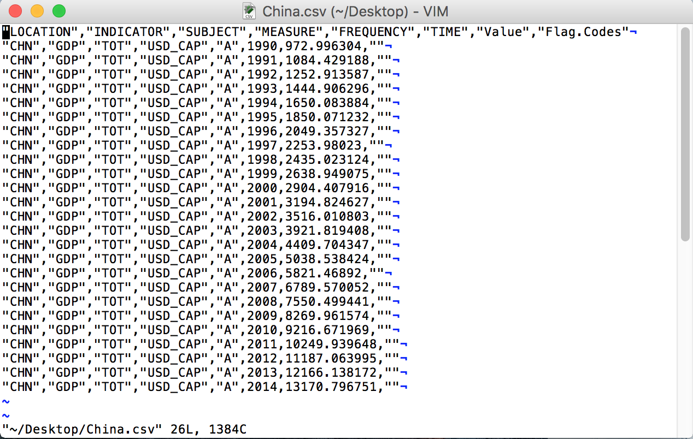
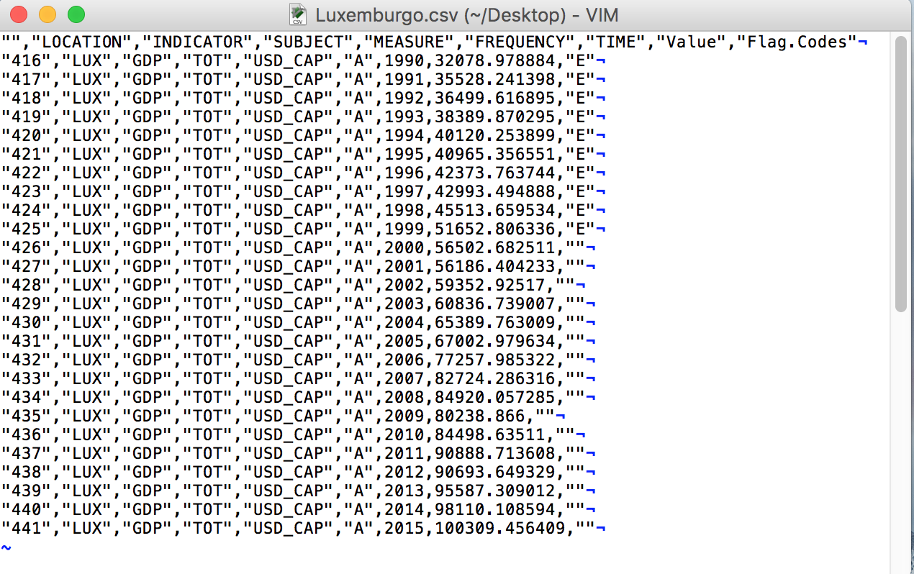

No capítulo "Operações Básicas" vimos como criar um data frame
na linha de comando, digitando todos os valores para cada
coluna do data frame. Isso é útil quando temos uma quantidade 
relativamente pequena de dados, mas na maioria dos 
casos vamos trabalhar com "tabelas" que têm dezenas
de colunas e possivelmente milhares de linhas. Ninguém
espera ter que digitar isso tudo, ao contrário, você vai
receber esses dados em um arquivo.

O R pode ler qualquer tipo de arquivo texto e, com a ajuda
de "pacotes" externos (vamos ver isso mais para frente)
o R pode ler diretamente planilhas Excel.

Vamos começar com um tipo de arquivo muito comum e popular
para se compartilhas dados: arquivos "csv" (comma separated
values). Se você é um usuário de planilhas provavelmente
já se deparou com arquivos csv. Esse tipo de arquivo
é muito popular para se compartilhar dados entre diferentes
sistemas operacionais (Unix, Linux, Mac, Windows)
pois, por conter apenas texto,
pode ser entendido praticamente por qualquer máquina.

Se você procurar por dados abertos na Internet vai encontrar
muita coisa que pode ser baixada em formato csv.
Por exemplo, no site da OECD
(https://data.oecd.org/gdp/gross-domestic-product-gdp.htm)
você encontra dados do PIB de vários países ao longo 
de muitos anos.

Vamos usar os dados de *PIB per capta* de 1990 a 2015 de todos os
países disponíveis. Por via das dúvidas, baixei esse arquivo
no dia 4 de junho de 2016 e ele está disponível aqui:

https://raw.githubusercontent.com/abreups/doexcelaor/master/dados/DP_LIVE_05062016020028091.csv

Baixe esse arquivo e salve em um diretório conhecido do seu
computador. No meu caso ele está salvo no meu Desktop.
O "diretório" (ou pasta) no meu computador é (estou usando
um Mac):
````r
/Users/pauloabreu/Desktop
````

Muito bem. Para lermos este arquivo para dentro do R usamos 
a função `read.csv()`.

Se você der uma olhadinha no help dessa função você verá que
ela aceita alguns parâmetros:


Peraí! Mas por que no help da função `read.csv()` tem essa função
`read.table()`?

Bem, porque a função `read.csv()` é "a mesma coisa" que a função 
`read.table()` só que alguns parâmetros passados para a 
função já estão pré-definidos. Por exemplo, como o próprio
nome diz, um arquivo csv tem os dados separados por vírgula,
certo? Então, o parâmetro `sep` na função `read.table()`
está definido como "vazio" (`sep = ""`); já na função 
`read.csv()` ele está definido como `sep = ","`, isto
é, o caracter que separa os dados é uma vírgula.

Outra coisa: num arquivo csv "bem comportado" a primeira
linha do arquivo costuma ser o cabeçalho, certo? É
a linha que tem os "nomes das colunas". Essa primeira
linha é o "header". Veja que na função `read.table()`
o header está definido como `FALSE`, ou seja, o *default*
é que não tem header. Já na função `read.csv()` ele está
definido como `header = TRUE`: sim, há um cabeçalho.

OK, passado o susto, veja que o primeiro parâmetro
a ser passado para a função é `file`, ou seja,
o nome do arquivo (com o caminho para encontrá-lo).

Quando você passa parâmetros para uma função do R
você pode colocar o parâmetro na mesma sequencia
que o help indica ou dizer explicitamente qual
parâmetro você está passando.

Por exemplo, podemos usar a função `read.csv()` assim:

````r
read.csv("nome_do_arquivo.csv")
````

ou assim:

````r
read.csv(file = "nome_do_arquivo.csv")
````

Pode parecer meio besta usar a segunda forma já
que a primeira funciona, mas se você quiser
especificar que o separador de dados não é uma
vírgula mas, por exemplo, uma barra vertical `|`,
é mais fácil (e seguro) usar o nome do parâmetro
do que ficar contando qual a posição dele na
lista de parâmetros (eu particularmente nunca fiz isso).
Na prática você vai fazer assim:

````r
read.csv(file = "nome_do_arquivo.csv", sep="|")
````

e veja que assim també é válido:

````r
read.csv(sep="|", file = "nome_do_arquivo.csv")
````

pois a função `read.csv()` vai saber exatamente o que
é cada coisa que você está passando para ela.

Chega de conversa e vamos carregar o arquivo.
Digite o comando comando

````r
read.csv(file = "/Users/pauloabreu/Desktop/DP_LIVE_05062016020028091.csv")
````

e veja o que acontece.

Provavelmente você viu um monte de letras e números
passando pela tela da console até parar com o 
prompt `> `. Que foi isso?

O comando `read.csv()` foi lá onde você indicou, leu
o arquivo e listou na tela da console o arquivo
inteiro.

Ah, mas peraí. Queremos guardar os dados do arquivo
para usar depois! Vamos então guardar os resultado
do comando numa variável! Quer tal, `pib`:

````r
pib <- read.csv(file = "/Users/pauloabreu/Desktop/DP_LIVE_05062016020028091.csv")
````

Execute o comando e repare que a variável `pib` tem 
1163 observações (linhas) e 8 variáveis (colunas).

Clique no nome da variável `pib` lá na área
de "Environment" no canto superior direito e você
verá uma prévia dessa variável no canto superior
esquerdo da janela do R Studio. Seu ambiente deve
se parecer com isso:


A coluna LOCATION possui o nome do país representado
pelo código ISO de 3 letras (veja essa referência, por
exemplo: https://pt.wikipedia.org/wiki/ISO_3166-1), a coluna
TIME possui o ano e a coluna Value possui o valor
do PIB per capta.

As colunas INDICATOR, SUBJECT, MEASURE e FREQUENCY
informam que o indicador é GDP (isto é, PIB), 
o valor total do PIB (TOT), a medida do PIB (que
é PIB per capta) e a frequencia da medida (que é
anual). A coluna Flag.Codes indica, por exemplo,
se o valor do PIB é estimado.
Veja, nada disso tem a ver com o R. Esta é a descrição
dos dados que obtivemos do site da OEDC.

Com a função `class(pib)` você vai ver que nossa variável `pib`
é do tipo `data.frame` e com o comando `str(pib)` você
consegue ver a "estrutura" da variável.


````r
> class(pib)
[1] "data.frame"
> str(pib)
'data.frame':	1163 obs. of  8 variables:
 $ LOCATION  : Factor w/ 50 levels "ARG","AUS","AUT",..: 2 2 2 2 2 2 2 2 2 2 ...
 $ INDICATOR : Factor w/ 1 level "GDP": 1 1 1 1 1 1 1 1 1 1 ...
 $ SUBJECT   : Factor w/ 1 level "TOT": 1 1 1 1 1 1 1 1 1 1 ...
 $ MEASURE   : Factor w/ 1 level "USD_CAP": 1 1 1 1 1 1 1 1 1 1 ...
 $ FREQUENCY : Factor w/ 1 level "A": 1 1 1 1 1 1 1 1 1 1 ...
 $ TIME      : int  1990 1991 1992 1993 1994 1995 1996 1997 1998 1999 ...
 $ Value     : num  17715 18033 19023 20054 21248 ...
 $ Flag.Codes: Factor w/ 3 levels "","B","E": 1 1 1 1 1 1 1 1 1 1 ...
> 
````

O tipo `factor` já vimos: é a "mesma coisa" que o tipo texto,
mas representa categorias. Veja que, apesar de termos 1163
linhas, há apenas 50 tipos Factor. Como a coluna LOCATION
contém o nome do país, significa que temos 50 países
representados (quer dizer que temos várias linhas por país;
é meio óbvio, pois cada linha contém o PIB de um determinado
ano...).

TIME e Value são variáveis numéricas. A diferença entre o tipo
`int` e o tipo `num` é basicamente o "tamanho do número"
que cada uma consegue representar (mas isso não é importante
agora).

Relembrando algumas funções básicas, se quisermos saber
o maior PIB per capta e o menor PIB per capta, podemos 
usar as funções `max()` e `min()`, respectivamente (o
valor do PIB está na coluna `Value`).

````r
> max(pib$Value)
[1] 100309.5
> min(pib$Value)
[1] 972.9963
> 
````

E para recuperar a linha inteira de cada um daqueles
valores:

```r
> pib[pib$Value == max(pib$Value),]
    LOCATION INDICATOR SUBJECT MEASURE FREQUENCY TIME    Value Flag.Codes
441      LUX       GDP     TOT USD_CAP         A 2015 100309.5           
> pib[pib$Value == min(pib$Value),]
    LOCATION INDICATOR SUBJECT MEASURE FREQUENCY TIME    Value Flag.Codes
804      CHN       GDP     TOT USD_CAP         A 1990 972.9963           
> 
````

LUX é o país Luxemburgo e CHN é China.

Deixe-me ler seus pensamentos... Você agora entrou em
pânico porque você não lembra como se chega nesses
comandos acima. Acertei?

Se eu acertei, então vamos devagar porque a ideia aqui
é você introjetar esse negócio até ficar tão craque
que você não vai nem se lembrar mais do que era planilha
Excel. :-)

1. Achar o PIB máximo você sabe, certo? É só usar a função
`max()` e passar a coluna onde estão os PIBs, que é
a coluna `Value` da nossa variável `pib`. Portanto:
`max(pib$Value)`. Se você fizer só isso você vai 
obter um número (que é o valor máximo de PIB encontrado
na coluna. No caso, `100309.5`). Digite o comando
pra ver o resultado.

2. Agora você quer saber em qual linha está esse valor.
Então pense assim: "o valor não é `100309.5`. O valor
é `max(pib$Value)`".

3. Onde é que `pib$Value` (que é a coluna inteira
dos valores de PIBs) é **igual** a esse valor
aí que você quer? Sacou? **Igual**! Ou seja, `==`.
Então: `pib$Value == max(pib$Value)`.

4. O resultado de `pib$Value == max(pib$Value)` é
um monte de `FALSE` e um único `TRUE` (a menos
que tenhamos exatamente o mesmo valor numérico
em mais de uma linha. Haja coincidência, não?).
Digite esse comando para ver o resultado (na dúvida
faça sempre isso. Vá digitando os comandos pra ver
o que acontece. Use a seta para cima do teclado
 para economizar digitação!).

5. Se o comando anterior é um monte de `FALSE` e
`TRUE`, então basta colocá-lo como parâmetro de 
linha no par `[ linhas , colunas ]` do data frame `pib`.
Ou seja, recheamos `pib[ linhas , colunas ]` trocando
"linhas" por aquele treco que me dá um monte de `FALSE`
e `TRUE`. E deixamos "colunas" vazio para indicar
que queremos todas as colunas: 
`pib[  pib$Value == max(pib$Value)  ,  ]`.

Espero que você tenha acompanhado o raciocínio passo-a-passo.
É assim que eu me habituei a fazer mentalmente quando
tenho que escrever esses comandos que geram um subconjunto
de dados. E eu literalmente vou fazendo desse jeito: começo
com o comando mais de dentro e vou colocando o sinal
de `==`, depois os colchetes, até chegar no comando final.
Fica a dica!

Passado o ataque de pânico, voltemos à análise dos dados.

Como os dados de PIB vão de 1990 até 2015, vemos que em 2015
Luxemburgo estava "no topo da lista" e em 1990 a China estava
"no fundo do poço".

> Uma paradinha rápida para umas continhas. Estamos
> lidando com "PIB per capta", ou seja, por habitante.
> A China tinha aproximadamente 1 billhão de
> habitantes em 1990 e Luxemburgo uns 500 mil.
> Multiplicando o PIB per capta pela quantidade de
> habitantes vemos que o PIB da China em 1990 era
> de mais ou menos 972 bilhões de dólares enquanto
> o PIB de Luxemburgo em 2015 era de mais ou menos
> 50 bilhões de dólares.


Mas como será o histórico do PIB de Luxemburgo e da China?
Ano após ano?

Não existe uma única forma de se obter esses resultados, mas
várias. Cada um acaba criando sua forma preferida.
Eu gosto de fazer assim:

1. separo os dados do país em uma variável

2. faço as manipulações usando essa variável

Vamos separar os dados de Luxemburgo em uma
variável que vamos chamar de ... `lux`!
Vou usar o método de primeiro criar uma
variável só com as linhas e depois usar
essa variável para indicar quais a linhas
que queremos. 

````r
> linhas <- pib$LOCATION == "LUX"
> lux <- pib[linhas,]
> lux
    LOCATION INDICATOR SUBJECT MEASURE FREQUENCY TIME     Value Flag.Codes
416      LUX       GDP     TOT USD_CAP         A 1990  32078.98          E
417      LUX       GDP     TOT USD_CAP         A 1991  35528.24          E
418      LUX       GDP     TOT USD_CAP         A 1992  36499.62          E
419      LUX       GDP     TOT USD_CAP         A 1993  38389.87          E
420      LUX       GDP     TOT USD_CAP         A 1994  40120.25          E
421      LUX       GDP     TOT USD_CAP         A 1995  40965.36          E
422      LUX       GDP     TOT USD_CAP         A 1996  42373.76          E
423      LUX       GDP     TOT USD_CAP         A 1997  42993.49          E
424      LUX       GDP     TOT USD_CAP         A 1998  45513.66          E
425      LUX       GDP     TOT USD_CAP         A 1999  51652.81          E
426      LUX       GDP     TOT USD_CAP         A 2000  56502.68           
427      LUX       GDP     TOT USD_CAP         A 2001  56186.40           
428      LUX       GDP     TOT USD_CAP         A 2002  59352.93           
429      LUX       GDP     TOT USD_CAP         A 2003  60836.74           
430      LUX       GDP     TOT USD_CAP         A 2004  65389.76           
431      LUX       GDP     TOT USD_CAP         A 2005  67002.98           
432      LUX       GDP     TOT USD_CAP         A 2006  77257.99           
433      LUX       GDP     TOT USD_CAP         A 2007  82724.29           
434      LUX       GDP     TOT USD_CAP         A 2008  84920.06           
435      LUX       GDP     TOT USD_CAP         A 2009  80238.87           
436      LUX       GDP     TOT USD_CAP         A 2010  84498.64           
437      LUX       GDP     TOT USD_CAP         A 2011  90888.71           
438      LUX       GDP     TOT USD_CAP         A 2012  90693.65           
439      LUX       GDP     TOT USD_CAP         A 2013  95587.31           
440      LUX       GDP     TOT USD_CAP         A 2014  98110.11           
441      LUX       GDP     TOT USD_CAP         A 2015 100309.46           
> 
````

Vamos fazer o mesmo para a China, mas vou pular
a parte de criar a variável `linhas` e partir
direto pro resultado final. Vou guardar os dados
da China numa variável chamada `chn` (que falta de
criatividade, não?):

````r
> chn <- pib[pib$LOCATION == "CHN",]
> chn
    LOCATION INDICATOR SUBJECT MEASURE FREQUENCY TIME      Value Flag.Codes
804      CHN       GDP     TOT USD_CAP         A 1990   972.9963           
805      CHN       GDP     TOT USD_CAP         A 1991  1084.4292           
806      CHN       GDP     TOT USD_CAP         A 1992  1252.9136           
807      CHN       GDP     TOT USD_CAP         A 1993  1444.9063           
808      CHN       GDP     TOT USD_CAP         A 1994  1650.0839           
809      CHN       GDP     TOT USD_CAP         A 1995  1850.0712           
810      CHN       GDP     TOT USD_CAP         A 1996  2049.3573           
811      CHN       GDP     TOT USD_CAP         A 1997  2253.9802           
812      CHN       GDP     TOT USD_CAP         A 1998  2435.0231           
813      CHN       GDP     TOT USD_CAP         A 1999  2638.9491           
814      CHN       GDP     TOT USD_CAP         A 2000  2904.4079           
815      CHN       GDP     TOT USD_CAP         A 2001  3194.8246           
816      CHN       GDP     TOT USD_CAP         A 2002  3516.0108           
817      CHN       GDP     TOT USD_CAP         A 2003  3921.8194           
818      CHN       GDP     TOT USD_CAP         A 2004  4409.7043           
819      CHN       GDP     TOT USD_CAP         A 2005  5038.5384           
820      CHN       GDP     TOT USD_CAP         A 2006  5821.4689           
821      CHN       GDP     TOT USD_CAP         A 2007  6789.5701           
822      CHN       GDP     TOT USD_CAP         A 2008  7550.4994           
823      CHN       GDP     TOT USD_CAP         A 2009  8269.9616           
824      CHN       GDP     TOT USD_CAP         A 2010  9216.6720           
825      CHN       GDP     TOT USD_CAP         A 2011 10249.9396           
826      CHN       GDP     TOT USD_CAP         A 2012 11187.0640           
827      CHN       GDP     TOT USD_CAP         A 2013 12166.1382           
828      CHN       GDP     TOT USD_CAP         A 2014 13170.7968           
> 
````

Com os dados dos países separados assim, dá pra calcular
os valores máximos e mínimos para cada um deles facilmente.
Vamos então calcular o valor máximo do PIB da China
e o valor mínimo do PIB de Luxemburgo.

````r
> max(chn$Value)
[1] 13170.8
> min(lux$Value)
[1] 32078.98
> 
````

E a linha completa onde estão esses valores (agora não tem moleza;
faça o raciocínio aí):

````r
> chn[chn$Value == max(chn$Value),]
    LOCATION INDICATOR SUBJECT MEASURE FREQUENCY TIME   Value Flag.Codes
828      CHN       GDP     TOT USD_CAP         A 2014 13170.8           
> lux[lux$Value == min(lux$Value),]
    LOCATION INDICATOR SUBJECT MEASURE FREQUENCY TIME    Value Flag.Codes
416      LUX       GDP     TOT USD_CAP         A 1990 32078.98          E
> 
````

### A função `table()`


Quando afirmei na sessão anterior que ao procurarmos o valor do PIB
máximo obteríamos vários `FALSE` e um `TRUE`, deixei a explicação
na base da intuição, que seria muita coincidência termos dois
valores de PIB per capita idênticos. Mas, e se tivéssemos?
Até aí nenhum problema, mas dá pra saber de antemão se teremos
mais de um valor `TRUE`? Obviamente que sim, e uma forma muito
prática de se fazer isso é usar a função `table()`.

A função é muito simples. Passe como parâmetro para ela alguma
coisa que possa ser "contada". Por exemplo, se quisermos contar
quantas vezes o código ISO de cada país aparece na coluna
`LOCATION` do data frame `pib`, fazemos:

````r
> table(pib$LOCATION)

  ARG   AUS   AUT   BEL   BRA   CAN   CHE   CHL   CHN   COL   CZE   DEU   DEW   DNK  EA19 
   11    26    26    26    12    26    26    26    25    14    26    26     2    26    20 
  ESP   EST  EU28   FIN   FRA   GBR   GRC   HUN   IDN   IND   IRL   ISL   ISR   ITA   JPN 
   26    23    21    26    26    26    26    25    21     6    26    26    21    26    26 
  KOR   LTU   LUX   LVA   MEX   NLD   NOR   NZL  OECD OECDE   POL   PRT   RUS   SAU   SVK 
   26    21    26    21    26    26    26    26    26    26    26    26    19    25    24 
  SVN   SWE   TUR   USA   ZAF 
   21    26    26    26    25 
> 
````

De cara já dá pra ver que nem todos os países têm a mesma quantidade
de informações (linhas para todos os anos) sobre PIB per capita na tabela da OECD.

A função `table()` sempre tenta converter o campo que você
passa como parâmetro para o tipo `Factor`. Devido ao funcionamento
interno do R, se você fizer um subconjunto de um data frame
(como fizemos criando os data frames `chn` e `lux`), o R vai
"lembrar" de todos os Factors do data frame original, mas vai
contá-los como "zero" nos data frames derivados.

Então, se dermos como parâmetro para a função `table()` o data
frame da China (`chn`), veja o que acontece:

```r
> table(chn$LOCATION)

  ARG   AUS   AUT   BEL   BRA   CAN   CHE   CHL   CHN   COL   CZE   DEU   DEW   DNK  EA19 
    0     0     0     0     0     0     0     0    25     0     0     0     0     0     0 
  ESP   EST  EU28   FIN   FRA   GBR   GRC   HUN   IDN   IND   IRL   ISL   ISR   ITA   JPN 
    0     0     0     0     0     0     0     0     0     0     0     0     0     0     0 
  KOR   LTU   LUX   LVA   MEX   NLD   NOR   NZL  OECD OECDE   POL   PRT   RUS   SAU   SVK 
    0     0     0     0     0     0     0     0     0     0     0     0     0     0     0 
  SVN   SWE   TUR   USA   ZAF 
    0     0     0     0     0 
> 
````

Todos os países que não são `CHN` tem contagem zero, e a China tem 
25 observações (linhas).

Diz o ditado popular que "o que abunda não prejudica". Então não é
que esteja "errado" o que o R está fazendo, mas certamente há situações
onde não precisamos de tudo isso. Vamos então "descartar" (*to drop*,
em versão livre para Inglês) todos os *levels* (`level` é o nome
que o R dá para a quantidade de "categorias" que ele encontrou
para o tipo `Factor`) que não existem mais no novo data frame (o que
derivamos do data frame maior -- o que tinha mais *levels*). Estou 
explicando desta forma porque aí o nome da função fica fácil de 
lembrar: `droplevels()`:

````r
> chn <- droplevels(chn)
> 
````

O que fizemos foi "dropar todos os levels zerados" (e assassinar
a língua Portuguesa com essa frase) 
do data frame `chn` e guardar o resultado de novo na variável `chn`
(ou seja, sobrescrevemos a variável `chn` com um novo valor).

Parece que nada aconteceu, mas agora vamos usar a função `table()`
novamente:

````r
> table(chn$LOCATION)

CHN 
 25 
> 
````

Pronto. Ficou bem mais fácil de ver quantas observações (linhas) de
`CHN` temos no data frame da China.

Voltando então à questão dos `FALSE` e `TRUE`.

`pib$Value == max(pib$Value)` nos devolvia
um monte de `FALSE` e `TRUE`. Portanto, para contarmos
quantos temos de cada um deles, vamos passar esse resultado
diretamente para a função `table()`:

````r
> table( pib$Value == max(pib$Value) )

FALSE  TRUE 
 1162     1 
> 
````

Olha lá! Só um `TRUE`.

A função `table()` é uma "mão na roda" e vamos utilizá-la
muito, tanto para fazer esse tipo de investigação rápida
como para criar tabelas para usarmos em relatórios.

## O que pode dar "errado" ao se ler um arquivo csv

As duas situações mais comuns de ocorrerem quando
se lê um arquivo csv são:

1. Os dados (com ou sem cabeçalho) não começam na
primeira linha, mas algumas linhas abaixo.

2. Não é vírgula o caracter que separa os dados no
arquivo csv.


No caso um, é comum que o arquivo csv tenha algumas linhas
no início que não fazem parte dos dados propriamente
ditos. Os motivos para isso ocorrer são vários, como por
exemplo, a primeira linha ser uma frase falando a data
em que o arquivo foi gerado e de que sistema ele veio, ou
coisas do tipo. São motivos legítimos, mas não nos ajudam
na hora de ler os dados.

Para se livrar dessas linhas há um parâmetro na função 
`read.csv()` chamado `skip`. O que ele faz é "saltar"
(*to skip*) uma certa quantidade de linhas antes de começar
a considerar que as linhas lidas são parte dos dados.

Então se você quisesse saltar uma linha apenas, o comando
seria:

````r
read.csv("caminho e nome do arquivo", skip = 1)
````

O segundo caso também é relativamente comum.
Alguns arquivos csv possuem como caracter de separação
dos dados uma barra vertical (`|`) ou "ponto e vírgula"( `;`).
O principal motivo para isso é quando a vírgula costuma
aparecer como parte dos dados, tal como em um endereço: 
"Avenida Brasil, 100". O autor do arquivo csv usou então como
artifício mudar o caracter que separa os dados para não
dar confusão.


Por fim, se o arquivo csv tiver alguma "malformação"
a função `read.csv()`vai reclamar. Pode ser que alguma linha
não tenha todos os campos (algum está faltando e a vírgula
correspondente para indicar que o campo estaria vazio está faltando).
Mas aí já entramos na categoria de "limpeza de dados" (os termos
em Inglês para isso são *data cleansing* ou *data scrubbing*;
esse último se traduziria como "escovação de dados"!).
Isto já está fora do contexto desse livro, portanto não vamos
elaborar sobre o assunto (daria um outro livro!).


## Salvando um arquivo csv

Supoha que você leu um arquivo csv, fez algumas manipulações com 
os dados e agora quer salvar esse resultado como
um arquivo csv também. Por exemplo, digamos que você queira salvar 
os dados separados da China e de Luxemburgo em dois
arquivos csv distintos. A função `write.csv()` serve para isso.

Se você consultar o help da função `write.csv()` vai ver que 
ele também começa com uma função chamada `write.table()`,
semelhante à `read.table()`. Como seria de se imaginar,
`write.table()` é a função genérica e `write.csv()` já
coloca por padrão que o separador dos campos é a vírgula.
Vale muito a pena dar uma olhada no help das funções pois
sempre tem detalhes interessantes (e muita coisa avançada
também).

Há um detalhe importante no uso dessas funções. Por padrão,
se você usar a função `write.csv()` você vai notar que o seu
arquivo de saída conterá uma primeira coluna com números.
Esses números são o valor das linhas do data frame original
de onde o data frame derivado foi construído! No caso da 
China, por exemplo, se você consultar o valor de `chn` na console
verá que a primeira coluna começa com 804 e termina com 828
(digite `chn` na console e aperte Enter).

Isso acontece porque, por padrão, a função `write.csv()`
tem o parâmetro `row.names = TRUE`. `row` é "linha",
`names` é "nomes", portanto `row.names` seria "nomes das
linhas". Aqueles números são os "nomes" das linhas.

Finalmente, assim como na função `read.csv()`, na função
`write.csv()`, quando você especificar o nome do arquivo,
coloque o caminho completo de onde o arquivo vai ser
escrito.

Pra ver a diferença, vamos salvar os dados da China sem
os "nomes das linhas" e os dados de Luxemburgo com os
"nomes das linhas":

````r
> write.csv(chn, file = "/Users/pauloabreu/Desktop/China.csv", row.names = FALSE)
> write.csv(lux, file = "/Users/pauloabreu/Desktop/Luxemburgo.csv")
> 
````

Se abrirmos esses dois arquivos num editor de texto simples
(não precisa ser um programa de planilha eletrônica, mas se
você tiver um também não vai fazer nenhum mal) veremos que
os dados da China começam com a coluna `LOCATION`:



e que os dados de Luxemburgo têm os "nomes" das linhas como
primeira coluna!



Imagino que dificilmente você vai querer esses números na frente,
então lembre-se sempre de colocar o parâmetro `row.names = FALSE`
na função `write.csv()`.

