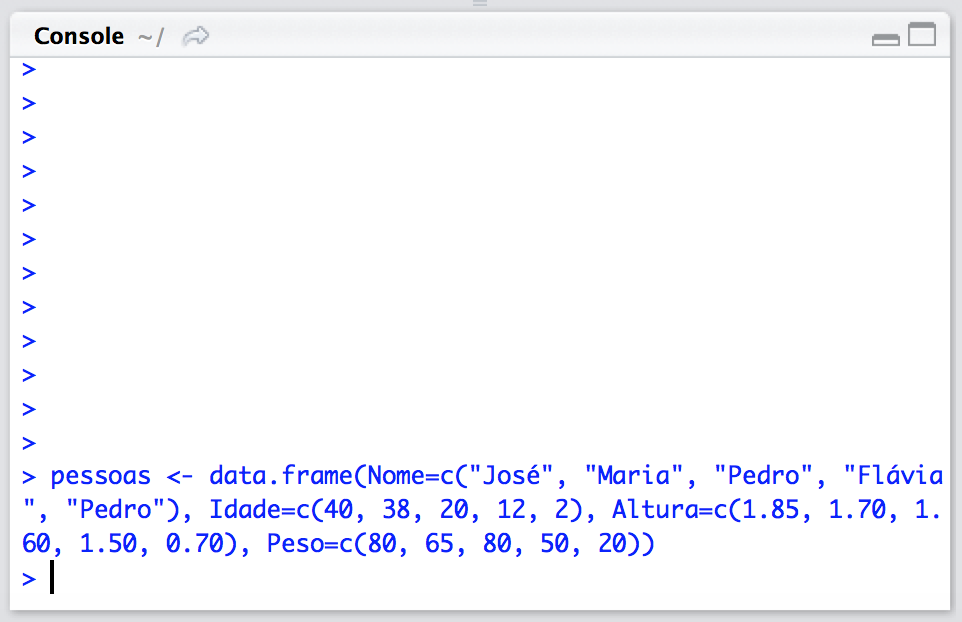
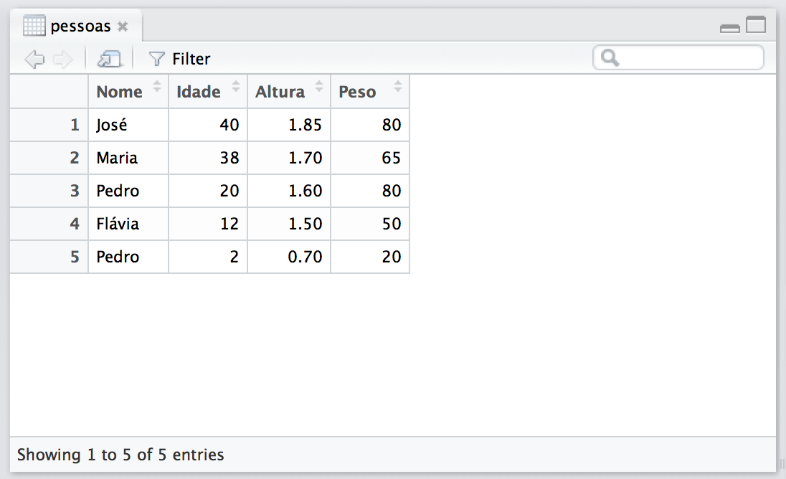

# Operações Básicas
Agora que você já tem o R e o R Studio instalados no seu computador
vamos falar um pouco de alguns conceitos básicos que você tem que 
entender para começar a usar este ambiente.

## A Console

Tudo o que você digitar na console será executado assim que 
você bater na tecla Enter. Por exemplo, digite na console:

````r
> 1+2
````

tecle Enter e o resultado aparecerá:

````r
[1] 3
````

Seu console deve estar provavelmente assim:


não se preocupe com esse 1 entre colchetes; ele é apenas a forma
do R indicar a saída do resultado. O que nos interessa é o 3, que 
é o resultado da soma.

Você pode fazer um monte de operações matemáticas diretamente na
linha de comando. Experimente tirar a raiz quadrade de 2 e multiplicar
pelo cubo de 3:

````r
> sqrt(2) * 8**3
[1] 724.0773
````

todas as regras que você aprendeu na escola sobre a precedência de 
algumas operações sobre outras vale aqui também. No caso, a potenciação
é calculada antes da multiplicação. Mas você pode colocar parênteses
para tornar a precedência explícita. Por exemplo:

````r
> 3 + 2 * 4 + 1
[1] 12
> (3 + 2) * (4 + 1)
[1] 25
````

No primeiro caso a multiplicação tem precedência, então nos restou a soma
`3 + 8 + 1`. No segundo caso, os parênteses forçaram que as somas fossem
calculadas antes e ficamos com a operação `5 * 5`.

A propósito, os espaços em branco entre os números e os sinais não afetam
o reultado. Você poderia ter digitado `3+2*4    +    1` que o resultado seria
o mesmo.

Aqui vai a primeira dica de utilização da Console: pressione a seta para cima
no seu teclado e a Console mostrará o último comando executado. Se você teclar
Enter o comando será executado. Se, ao invés de teclar Enter, você pressionar
novamente a tecla para cima, a Console mostrará o penúltimo comando executado.
Vá pressionando várias vezes a tecla para cima (e tente a seta para baixo
também) para navegar pelo histórico de comandos que você executou.

Isso é muito conveniente quando você digita um comando bem comprido e ao
teclar o Enter a Cosnole te dá um erro. Por exemplo, digite o comando a
seguir exatamente como mostrado:

````r 
> qrt(2)
Erro: não foi possível encontrar a função "qrt"
````

O R não conhece essa tal função `qrt`. Opa, era `sqrt`! A função
que calcula a raiz quadrada de seu argumento (no caso, o número 2).
Seta para cima, seta para a esquerda 6 vezes (até o início do comando),
digite o `s` que faltava, e Enter.

````r
> sqrt(2)
[1] 1.414214
````

OK, OK. O comando não era tão comprido assim e você poderia ter digitado 
tudo de novo, mas você entendeu a idéia, certo?

Você pode usar a seta para cima para consultar o histórico de comandos, mas
há uma outra forma. O R Studio possui no canto superior esquerdo
uma área que contém todo o histórico de comandos executados, conforme
ilustrado na figura a seguir:


Coloque o mouse sobre cada um dos ícones e veja o texto de ajuda que
aparece. Ele é bem autoexplicativo e você pode brincar à vontade para
ver o que acontece.

Mas vamos em frente.


## Variáveis

No Excel (ou qualquer outro software de planilha eletrônica) a 
forma usual de se armazenar um valor para poder utilizá-lo mais
tarde é colocar o valor numa célula. Essa operação é quase que
intuitiva para quem usa planilhas eletrônicas. Você guarda um certo
valor na célula A1, um outro valor na célula B1 e na célula C1 você
coloca uma fórmula que, por exemplo, soma os valores.

No R você guarda valores em variáveis. Uma variável é um "nome", uma 
palavra que tem que começar com uma letra (não pode começar com um
número). `banana` é uma palavra que começa com uma letra (`b`), portanto
pode ser o nome de uma variável. `3tigres` não pode ser nome de 
variável, pois começa com um número (`3`).

Você guarda um valor na variável `banana` através das seguintes sintaxes:

- sintaxe 1: 

```r
> banana = 1
```

- sintaxe 2:

```r
> banana <- 1
```

Para descobrir qual valor está guardado na variável `banana`, basta
digitar o nome da variável na console e bater Enter:

````r
> banana
[1] 1
````

A sintaxe 2 é a mais utilizada quando você pesquisa sobre código
em R na Internet, então é a que utilizaremos nesse texto.

Vamos guardar um outro valor em outra variável: `laranja`:

````r
> laranja <- 2
````

E novamente, para vermos o valor que está guardado na variável 
`laranja`, escrevemos seu nome na console e Enter

````r
> laranja
[1] 2
````

Agora podemos fazer como fazíamos na planilha: podemos fazer uma operação 
utilizando as variáveis `banana` e `laranja`. Veja os seguintes
exemplos:

````r
> banana + laranja
[1] 3
> banana / laranja
[1] 0.5
> banana**laranja
[1] 1
> laranja ** banana
[1] 2
> sin(laranja) / cos(banana)
[1] 1.682942
> banana == laranja
[1] FALSE

````

Temos uma soma, uma divisão, duas potenciações e por fim uma comparação que
diz que o valor guardado em `banana` não é igual (ou
seja, é `FALSO`) ao valor guardado em `laranja`.

Note que numa planilha, os valores das células são posicionais, ou seja,
a célula A1 (exemplo do primeiro parágrafo) guarda um certo valor e
a célula B1 guarda outro valor. No R, as variáveis não tem esse
conceito de "posição" (como as células da planilha). As variáveis
estão "na memória do 
computador", e ponto. Tudo o que estamos fazendo (cálculos, criando
e usando variáveis) não depende de nada "visual"; você não está vendo
os valores numa "tabela", você não pode pintar a variável `banana`
de amarelo e a `laranja` de alaranjado, como tenho certeza de que
você já deve ter feito com céluas de uma planilha!

Há um ponto sutil (ou não) aqui de diferença entre usar uma planilha
e o R. Na planilha é provável que, à medida que você vai fazendo
os cálculos, você já vai pensando em onde colocar as coisas no grid
da planilha. Já vai pintando as células, formatando o fonte das
letras, colocando bordas nas células, enquanto vai fazendo sua 
análise. No R não. Primeiro você faz a análise. Os resultados vão aparecendo
na console, são um tanto quanto "feinhos", não tem formatação. É isso
mesmo; o formato, o posicionamento do gráfico, a tabela bonita você 
só vai posicionar (num relatório) lá na
frente, no final. Não é que "tenha que ser assim". Mas vai por mim,
é mais fácil "perder tempo" com essas coisas de formatação
e cores mais pra frente, quando sua análise já estiver mais 
madura e os resultados "prontos".


## Tipos de dados

Até agora usamos valores numéricos armazenados em variáveis.
Também podemos guardar texto em variáveis. Por exemplo, podemos criar
uma variável chamada `nome` e uma outra chamada `idade` e aí fazemos
(atenção para as aspas):

````r
nome <- "Maria"
idade <- "20"
````

Então poderíamos gerar uma frase com o nome e a idade da pessoa assim:

````r
> nome <- "Maria"
> idade <- "20"
> cat(nome, "tem", idade, "anos.")
Maria tem 20 anos.
````

`cat()` é uma função do R que concatena, ou seja, cola um depois do outro,
vários argumentos (que são os valores dentro dos parênteses, separados
por vírgula).

Bem, e se tentarmos dividir o valor da variável `idade` pelo valor
da variável `laranja`? A matemática seria 20 dividido por 2 que resultaria
em 10. Vamos tentar?

````r
> idade / laranja
Error in idade/laranja : argumento não-numérico para operador binário
````

Caramba! O que aconteceu? Bem, tentamos dividir um número por um texto.
O valor de `laranja` é numérico, já o valor de `idade` é texto. Como saber?

Quando definimos o valor de `laranja` não colocamos aspas em torno do valor,
mas quando definimos o valor de `idade` colocamos aspas para definir o valor
de 20. As aspas dizem ao R que o que você está fornecendo são 
"caracteres de texto".

Lembra no Excel quando você quer digitar um número numa célula mas
não quer que o Excel trate aquilo como valor numérico, mas como
texto? No Excel começamos a digitação com um apóstrofe (ou aspas
simples) antes de digitar o número. Aqui a idéia é parecida (colocamos
o número entre aspas duplas).

Para vermos que tipo de informação uma variável guarda usamos a 
função `class()`
do R, assim:

````r
> class(laranja)
[1] "numeric"
> class(idade)
[1] "character"
````

Existem outros tipos de dados além de "numérico" e "caracter"; por exemplo,
temos o tipo "lógico". Esse tipo de dado tem apenas 2 valores: verdadeiro ou
falso (`TRUE` e `FALSE`, respectivamente em Inglês).

Quando fizemos a comparação entre os valores armazenados em `banana`i
 e `laranja`, obtivemos
a resposta `FALSE`. Se usarmos a função `class()` no resultado daquela
operação, veja o que acontece:

````r
> class(banana == laranja)
[1] "logical"
````

Ou seja, o resultado da comparação `banana == laranja` é `FALSE`, que
é um valor do tipo "lógico". `FALSE` não é texto, como se escrevêssemos
as letras F, A, L, S, E.

Já dá pra fazer muita coisa com esses três tipos de dados, então vamos
passar para um tipo de variável extremamente importante: data frame.

## Data frames

Data frame é um tipo de estrutura de dados que, para todos os efeitos
práticos, funciona como uma tabela. Sabe quando você carrega um arquivo
no Excel e olha para a planilha com as linhas e as colunas cheias de
valores? Então, no R, aquilo seria representado por um data frame.

Deixe-me ressaltar mais uma vez a diferença entre "olhar para a tabela"
(que é o que estamos acostumados a fazer na nossa interação com o Excel)
e ter uma tabela armazenada na memória do computador, sem necessariamente
tê-la numa representação visual (que é o jeito de trabalhar no R).

Vamos criar uma tabela hipotética com nomes de pessoas, suas idades (em
anos), alturas (em metros) e pesos (em Kilogramas). Seria algo assim:

Nome   | Idade | Altura | Peso
-------|-------|--------|-----
José   | 40    | 1.85   | 80
Maria  | 38    | 1.70   | 65
Pedro  | 20    | 1.60   | 80
Flávia | 12    | 1.50   | 50
Pedro  | 2     | 0.70   | 20

Seria muito fácil digitar isso em em planilha, não? Dá pra ver o paralelo
entre linhas e colunas e células na planilha.

Bem, no R vamos representar esses dados numa variável do tipo data frame,
da seguinte forma:

````r
> pessoas <- data.frame(Nome=c("José", "Maria", "Pedro", "Flávia", "Pedro"), Idade=c(40, 38, 20, 12, 2), Altura=c(1.85, 1.70, 1.60, 1.50, 0.70), Peso=c(80, 65, 80, 50, 20))
> 
````

Ao digitar esse comando no console, não se preocupe com a mudança de linha.
Você está digitando tudo numa linha só. À medida que você digita, ao chegar
no fim da linha, continue digitando como se nada tivesse acontecido e o
cursor vai passar automaticamente para a "linha de baixo". Só digite
Enter no final de tudo, para indicar ao R que você terminou o comando.

Se a sua janela de console for larga você deve ter uma linha mais 
ou menos assim:


E se sua janela de console for mais curtinha, você deve ter algo 
mais parecido com isso:



Não importa. É um comando só, numa linha só. E você pode ajustar a largura
da janela de console com o mouse, clicando na borda dela, segurando
o clique e arrastando o mouse.

Muito bem. Nesse ponto temos uma variável chamada `pessoas` que está
armazenando tudo o que digitamos. Vamos dar uma olhada no tipo da
variável `pessoas` com a função `class()`:

````r
> class(pessoas)
[1] "data.frame"
````

Viu só? Ela é do tipo data frame!

Se você digitar o nome dessa variável na console e Enter, teremos:

````r
> pessoas
    Nome Idade Altura Peso
1   José    40   1.85   80
2  Maria    38   1.70   65
3  Pedro    20   1.60   80
4 Flávia    12   1.50   50
5  Pedro     2   0.70   20
> 
````

Olha que bacana. Parece até uma tabela, não?
Compare o nome das colunas com a forma que digitamos o comando para
criar a variável `pessoas`. Todo nome de coluna tem o formato:

````r
nome_da_coluna=c( dados separados por vírgula )
````

Ou seja, para criarmos a tabela, fornecemos o nome da coluna e
entramos com todos os dados da coluna, separados por vírgulas.
Se colocarmos cada dado entre aspas, estamos dizendo que o dado
é do tipo texto, e se colocarmos sem as aspas, que ele é do tipo
numérico. Como queremos apenas os nomes das pessoas como tipo
texto, somente eles estão entre aspas.

A função `c()` do R "combina" todos os parâmetros passados para
ela (separados por vírgula). Você vai ver essa função `c()` muitas
vezes em uso!

Finalmente, depois de digitarmos cada nome de coluna com cada valor,
combinamos tudo em um tipo data frame com a função `data.frame()`.

Se fôssemos "ler em voz alta" o comando que criou o data frame, seria
algo assim: "a variável `pessoas` recebe um data frame com as seguintes
colunas onde cada coluna tem os seguintes valores".

O R Studio possui uma visualização bem útil para data frames. No
canto superior direito, clique na tab "Environment" e você verá
a lista de todas as variáveis atualmente definidas na sua sessão do R, 
como indicado na figura a seguir:


Repare que há uma variável chamada `pessoas` e que ela tem 5 observações
(ou seja, linhas) e 4 variáveis (colunas). Se você clicar no nome da
variável, uma janela à sua esquerda vai se abrir (acima da console)
e você poderá visualizar a tabela `pessoas` de forma bem semelhante
à visualização que você tem numa planilha Excel!



É possível fazer algumas coisas bem básicas nessa visualização,
como por exemplo, ordenar alfabeticamente ou numericamente, clicando
no nome da coluna. Você pode inclusive fazer alguns filtros básicos
clicando no ícone de filtro (parecido com um funil). Mas não se sinta
tentado a querer reproduzir as funcionalidades do Excel aqui. Essa
não é a ideia! Isso é apenas uma visualização básica. O poder do R
está na linha de comando!

Vamos explorar um pouco mais a variável `pessoas`. Quando criamos 
esta variável dissemos que a coluna Nomes teria valores do tipo
texto e as demais colunas teriam valores numéricos. Para verificarmos
quais são os tipos de valores que cada coluna em uma variável
data frame tem podemos usar a função `str()` (que é uma abreviação
para 'structure', ou estrutura).

````r
> str(pessoas)
'data.frame':	5 obs. of  4 variables:
 $ Nome  : Factor w/ 4 levels "Flávia","José",..: 2 3 4 1 4
 $ Idade : num  40 38 20 12 2
 $ Altura: num  1.85 1.7 1.6 1.5 0.7
 $ Peso  : num  80 65 80 50 20
> 
````

O resultado da função `str()` nos mostra uma linha para cada coluna
do data frame, o tipo de variável que aquela coluna possui e depois
nos dá uma amostra dos primeiros valores de cada coluna.

Mas o que é esse tal de 'Factor' que aparece como o tipo de dado
para a coluna 'Nome'? É simples: 'Factor' é "um tipo de texto", só
que "categorizado". Nós temos 5 nomes de pessoas mas 2 nomes são
iguais (Pedro), então temos 4 "categorias" (Fávia, José, Pedro, Maria).
Por enquanto vamos ficar por aqui no que diz respeito ao tipo Factor.

Como fazemos para nos referir a um determinado elemento do data frame?
Bem, em uma planilha usamos a notação  "coluna" e "linha". Por exemplo,
o elemento da primeira coluna com a primeira linha é a célula "A1".
As letras referem-se às colunas e os números às linhas. O elemento
da terceira coluna e segunda linha seria o "C2".

Pois bem, no R é o inverso. Primeiro usamos a referência da linha e
depois o da coluna. Se você se lembra um pouquinho de matrizes (sim,
aquele assunto que você estudou no Ensino Médio!), o R usa o sistema
de referência de matrizes, que é linha x coluna.

Portanto, no R, o elemento da primeira linha com a primeira coluna
é o elemento `[1,1]` (note que usamos colchetes para formar o par).
Já o elemento da segunda linha e terceira coluna é o `[2,3]`.
Aí basta colocar o nome do data frame antes dos colchetes
e pronto!

````r
> pessoas[1,1]
[1] José
Levels: Flávia José Maria Pedro
> pessoas[2,3]
[1] 1.7
> 
````

`pessoas[1,1]` é o nome do José e `pessoas[2,3]` é a altura da Maria.

Há uma variação na forma de se fazer referência a elementos do
data frame que se torna bastante prática quando queremos todos 
os elementos de uma linha; basta 
colocar o número da linha e deixar o número da coluna sem nada. É
como se estivéssemos dizendo ao R que queremos "todas as colunas"
para aquela linha. Exemplo: todos os elementos da linha 3:

````r
> pessoas[3,]
   Nome Idade Altura Peso
3 Pedro    20    1.6   80
> 
````

É claro que o mesmo funciona no lugar da coluna. Colocamos o valor
da coluna mas não colocamos nada no valor da linha (ou seja, "todas as
linhas"). Se quisermos todas as idades (coluna 2):

````r
> pessoas[,2]
[1] 40 38 20 12  2
>
````

Agora que sabemos referenciar os elementos de um data frame, vamos
fazer alguns cálculos. 

O Índice de Massa Corporal (IMC) é uma medida usada para se calcular
se uma pessoa está próxima de seu "peso ideal". (https://pt.wikipedia.org/wiki/Índice_de_massa_corporal).
Para se calcular o IMC de uma pessoa, divida seu peso em Kilogramas
pelo quadrado da altura da pessoa. Vamos fazer esse cálculo para a Maria
(que está na linha 2 do nosso data frame):

````r
> pessoas[2,4] / (pessoas[2,3] ** 2)
[1] 22.49135
````

Ou seja, o peso da Maria está na linha 2 com a coluna 4, e a altura
da Maria está na linha 2 com a coluna 3. 22 é um excelente IMC. 
Parabéns para a Maria!

Será que tem um jeito de calcular o IMC de todas as pessoas no
data frame, de uma vez só, sem ter que ficar indicando cada
pessoa por vez? 

Se você fosse fazer isso numa planilha
você provavelmente criaria numa nova coluna uma fórmula que 
apontaria para cada elemento do peso e da altura. Cada uma das
células com a fórmula do IMC teria os índices correspondentes para
linha e coluna do peso e da altura. Você provavelmente faria isso
colocando a fórmula na primeira célula da nova coluna e depois
faria um "copiar e colar" da fórmula para todas as outras células e
os índices se ajustaria automaticamente para cada linha.
É como se sua planilha ficasse assim:

   |   A    |   B   |   C    |  D   |   E
---|--------|-------|--------|------|-----------
   | Nome   | Idade | Altura | Peso | IMC
---|--------|-------|--------|------|-----------
1  | José   | 40    | 1.85   | 80   | =D1/(C1**2)
2  | Maria  | 38    | 1.70   | 65   | =D2/(C2**2)
3  | Pedro  | 20    | 1.60   | 80   | =D3/(C3**2)
4  | Flávia | 12    | 1.50   | 50   | =D4/(C4**2)
5  | Pedro  | 2     | 0.70   | 20   | =D5/(C5**2)


